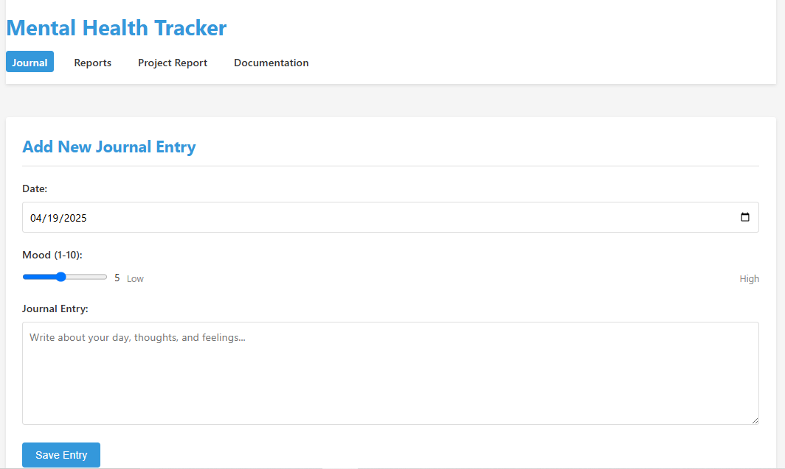
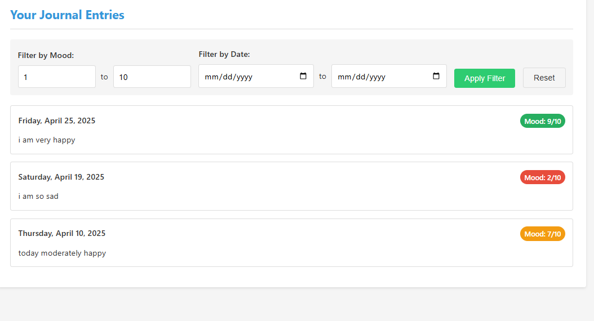

# Mental Health Tracker - Mood Analytics and Journal Visualization

This project is a web application that allows users to track their mental health by logging journal entries with mood ratings. The app generates reports on mood trends over time, highlights the best and worst days, and generates a word cloud of the most frequently used words in journal entries.

## Features

- **Mood Analytics**: Displays the average mood, best day (highest mood), and worst day (lowest mood).
- **Mood Trend Visualization**: A line chart shows mood trends over time.
- **Word Cloud**: A dynamic word cloud generated from the journal entries, showing the most common words.


## Journel Display

## Analytics Report


## Technologies Used

- **Backend**: Flask (Python)
- **Frontend**: HTML, CSS, JavaScript
- **Libraries/Tools**:
  - `Chart.js`: For generating mood trend charts and word cloud visualization.
  - `fetch()`: For retrieving journal entry data from the backend API.


## Setup Instructions

### Prerequisites

Before starting, ensure you have the following installed:

- Python 3.7 or higher
- Flask (for the backend)
- A text editor (VSCode, Sublime Text, etc.)

### Step 1: Clone the Repository

```bash
git clone https://github.com/Ehtisham1053/Mental-Health-Tracker.git
cd MENTAL-HEALTH_TRACKER


pip install flask
python api/app.py
